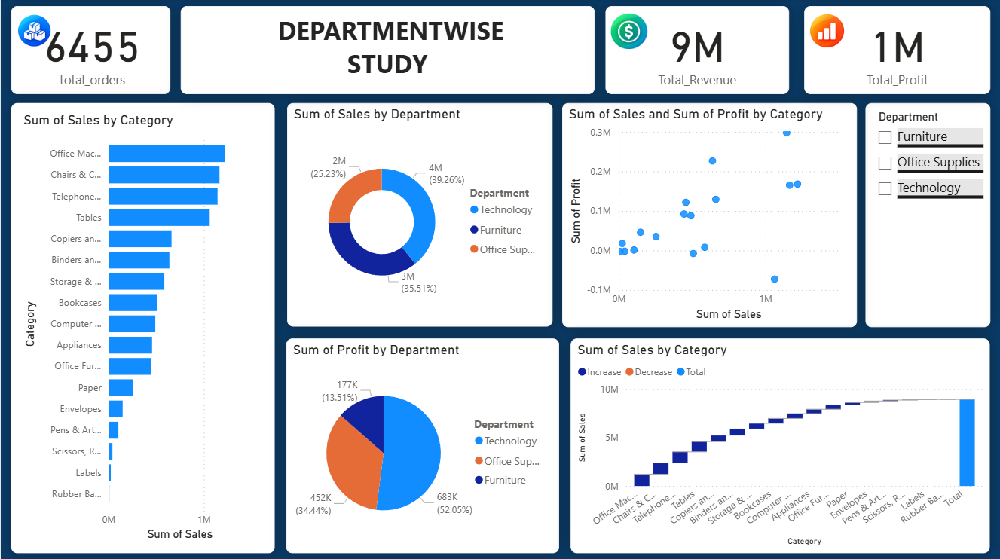

# Superstore Power BI Dashboard

## 📊 Project Overview

This project is an interactive Sales Analysis Dashboard created using Microsoft Power BI.

The dashboard analyzes Superstore sales data to understand sales performance, profitability, orders, quantity, customers, cities, regions, and departments.

## 🎯 Business Objective

The main objective of this dashboard is to:

- Analyze overall sales and profit performance
- Identify top-performing cities and departments
- Understand regional sales trends
- Analyze order quantity and customer performance
- Identify profitable and less profitable areas
- Support data-driven business decisions

## 🛠️ Tools & Technologies

- Microsoft Power BI
- Power Query
- DAX
- Data Modeling
- Data Visualization

## 📈 Key Dashboard Features

- Total Sales KPI
- Total Profit KPI
- Total Orders KPI
- Total Quantity KPI
- Sales and Profit Analysis
- City-wise Analysis
- Department-wise Analysis
- Regional Analysis
- Interactive Slicers
- Data Filtering and Drill-down

## 📸 Dashboard Preview

### Superstore Dashboard

## 📁 Project Files

- `Superstore data dashboard.pbix` – Power BI dashboard file
- `superstore-dashboard.png` – Dashboard screenshot
- `README.md` – Project documentation

## 💡 Key Insights

The dashboard helps identify:

- High-performing cities and regions
- Sales and profit trends
- Department performance
- Customer and order patterns
- Areas requiring business improvement

## 👨‍💻 Project Type

Data Analytics / Business Intelligence Project

Created using Microsoft Power BI.
